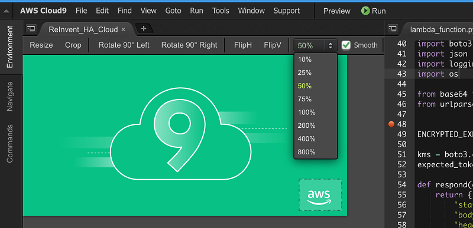
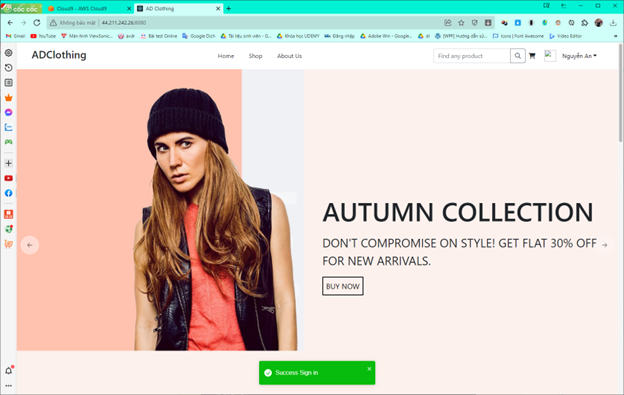

# Đề tài:Tìm hiểu và viết ứng dụng minh họa Cloud9-AWS

## I. Thông tin nhóm 13:

-   Nguyễn Văn An 20110434
-   Nguyễn Minh Đức 20110461
-   Trần Tấn Khoa 20110505

## II. Báo cáo

## A. Giới thiệu

Các công nghệ sử dụng

1. AWS Cloud9
2. Amazon EC2
3. Amazon DynamoDB
4. AWS Elastic Beanstalk
5. AWS CloudTrail
6. AWS Lambda
7. AWS API Gateway

### 1. Cloud9

#### 1.1 Cloud9 là gì

`Cloud 9` là một IDE trên môi trường cloud. Với cloud 9, mỗi khi khởi tạo một dự án mới, cloud 9 sẽ cung cấp một không gian làm việc chạy trên máy ảo, máy ảo đó đã được cài đặt sẵn các công cụ lập trình phổ biến như Java, Nodejs, git, DB(MySQL, SQLSever, MongoDB). Lập trình viên chỉ việc ngồi vào và gõ code, sau đó bấm run để chạy, không cần quan tâm gì tới việc cài đặt phần mềm v…v gì cả.

#### 1.2 Chức năng của Cloud9

#### 1.2.1 Trình chỉnh sửa đầy đủ tính năng

`AWS Cloud9` bao gồm một trình chỉnh sửa dựa trên trình duyệt giúp bạn dễ dàng viết, chạy và gỡ lỗi các dự án của mình. Khi bạn nhập, các đề xuất hoàn thành mã và gợi ý mã sẽ xuất hiện trong trình chỉnh sửa, giúp bạn viết mã nhanh hơn và tránh lỗi. Việc hoàn thành mã không chỉ dựa trên các số nhận dạng trong tệp của bạn mà còn dựa trên các thư viện tiêu chuẩn. Trình chỉnh sửa cũng cho phép bạn tùy chỉnh hoàn toàn chế độ xem của mình. Bạn có thể điều chỉnh bảng điều khiển của mình theo bất kỳ hướng nào bằng một thao tác kéo và thả đơn giản.

 

#### 1.2.2 Lựa chọn rộng rãi các cấu hình thực thi

`AWS Cloud9` hỗ trợ hơn 40 ngôn ngữ lập trình và loại ứng dụng bao gồm JavaScript, Python, PHP, Ruby, Go và C ++. Với Cloud9, bạn có thể chọn từ các cấu hình chạy mặc định hoặc xác định cấu hình tùy chỉnh bằng cách chỉ định các biến môi trường, tên tệp, tùy chọn dòng lệnh, v.v.

 

#### 1.2.3 Trình gỡ lỗi tích hợp

`AWS Cloud9` đi kèm với một trình gỡ lỗi tích hợp, cung cấp các khả năng thường được sử dụng như thiết lập các điểm ngắt, chuyển qua mã và kiểm tra các biến của bất kỳ ứng dụng PHP, Python, JS / Node.js, C / C ++ nào.

 

#### 1.2.4 Thiết bị đầu cuối tích hợp

`AWS Cloud9` cung cấp một thiết bị đầu cuối có đầy đủ các đặc quyền sudo cho phiên bản Amazon EC2 được quản lý của bạn. Nó cho phép bạn chạy các lệnh, chẳng hạn như đẩy các thay đổi mã sang git, biên dịch mã của bạn hoặc hiển thị đầu ra lệnh từ máy chủ của bạn. Giao diện dòng lệnh AWS đã được xác thực trước được cài đặt trong thiết bị đầu cuối của bạn, cho phép bạn dễ dàng kiểm soát và tương tác với các dịch vụ AWS trực tiếp từ dòng lệnh.

 

#### 1.2.5 Chỉnh sửa cộng tác và trò chuyện

`AWS Cloud9` cho phép bạn chia sẻ môi trường phát triển với nhóm của mình. Điều này giúp nhiều nhà phát triển trong nhóm của bạn chủ động thấy nhau nhập và ghép nối chương trình với nhau trên cùng một tệp. Cloud9 cho phép bạn sử dụng khả năng trò chuyện tích hợp để giao tiếp với nhóm của mình mà không cần phải rời khỏi IDE.

 

#### 1.2.6 Công cụ tích hợp trên cùng browser

`AWS Cloud9` tích hợp với `AWS CodeStar`, cho phép bạn nhanh chóng thiết lập chuỗi công cụ phân phối liên tục đầu cuối cho ứng dụng của mình và bắt đầu phát hành mã nhanh hơn trên AWS. CodeStar cung cấp trải nghiệm thống nhất cho phép bạn dễ dàng xây dựng, kiểm tra và triển khai các ứng dụng cho AWS với sự trợ giúp của `AWS CodeCommit, AWS CodeBuild, AWS CodePipeline và AWS CodeDeploy`. Trong một vài cú nhấp chuột, bạn sẽ có thể kết nối môi trường phát triển Cloud9 của mình với một chuỗi công cụ phân phối liên tục.

 

#### 1.2.7 Lịch sử sửa đổi tệp

`AWS Cloud9` lưu giữ lịch sử sửa đổi của các tệp trong môi trường phát triển của bạn. Điều này cho phép bạn nhanh chóng truy cập các thay đổi mã đã được thực hiện trong quá khứ và hoàn nguyên về lần lặp trước đó.

 

#### 1.2.8 Các phím tắt bàn phím

Ngoài các liên kết khóa mặc định, `AWS Cloud9` cung cấp lựa chọn sử dụng liên kết khóa VIM, Emacs và Sublime, cũng như xác định các ràng buộc tùy chỉnh của riêng bạn. Điều này cho phép bạn sử dụng các lệnh và phím tắt tương tự mà bạn đã quen thuộc.

 

 

#### 1.2.9 Trình chỉnh sửa hình ảnh tích hợp

`AWS Cloud9` hỗ trợ khả năng chỉnh sửa hình ảnh, cho phép bạn thay đổi kích thước, cắt, xoay hoặc lật hình ảnh ngay từ trình duyệt.

 

### 2. EC2

`Amazon Elastic Compute Cloud (Amazon EC2)` là một cơ sở hạ tầng điện toán đám mây được cung cấp bởi Amazon Web Services (AWS) giúp cung cấp tài nguyên máy tinh ảo hoá theo yêu cãu. `Amazon EC2` cung cấp các ứng dụng máy tính ảo hoá có thể mở rộng về khả năng xử lý cùng các thành phần phần cứng ào như bộ nhớ máy tinh (ram), vi xử lý, linh hoạt trong việc lựa chọn các phân vùng lưu trữ dữ liệu ở các nền tảng khác nhau và sự an toàn trong quản lý dịch vụ bới kiến trúc ảo hoá đám mây mạnh më của AWS.

### 3. DynamoDB

`Amazon DynamoDB` là một cơ sở dữ liệu NoSQL khóa-giá trị được quản lý hoàn toàn, phi máy chủ và được thiết kế để chạy các ứng dụng hiệu suất cao trên mọi quy mô. DynamoDB cung cấp tính năng bảo mật tích hợp, sao lưu liên tục, sao chép đa Khu vực tự động, lưu đệm trong bộ nhớ và các công cụ tải và xuất dữ liệu.

### 4. Elastic Beanstalk

`AWS Elastic Beanstalk` là dịch vụ giúp triển khai và điều chỉnh quy mô ứng dụng và dịch vụ web. Chỉ cần tải ứng dụng lên và Elastic Beanstalk sẽ tự động xử lý việc triển khai – từ cung cấp dung lượng, cân bằng tải và tự động điều chỉnh quy mô cho đến giám sát trạng thái ứng dụng.

### 5. AWS CloudTrail

`AWS CloudTrail` là một dịch vụ cho phép thực hiện việc quản lý, tuân thủ, kiểm tra vận hành và đánh giá rủi ro cho tài khoản AWS. Nó theo dõi và ghi lại hoạt động của tài khoản trên khắp cơ sở hạ tầng AWS của người dùng, trao quyền kiểm soát các hành động lưu trữ, phân tích và khắc phục cho người dùng.

### 6. AWS Lambda

`AWS Lambda` là một dịch vụ điện toán phi máy chủ, theo định hướng sự kiện, giúp bạn chạy mã cho hầu hết mọi loại ứng dụng hoặc dịch vụ backend mà không cần cung cấp hay quản lý máy chủ

### 7. API Gateway

`Amazon API Gateway` là dịch vụ giúp các nhà phát triển dễ dàng tạo, phát hành, duy trì, giám sát và bảo vệ API ở mọi quy mô. có thể tạo các API RESTful và API WebSocket để kích hoạt các ứng dụng giao tiếp hai chiều theo thời gian thực.

## B. Xây dựng ứng dụng minh họa trên cloud9 và sử dụngc các dịch vụ hỗ trợ khác

### 1.Đăng ký dịch vụ DynamoDB

    Bước 1: Vào trang https://aws.amazon.com và đăng nhập. Tìm kiếm dịch vụ DynamoDB

    Bước 2: Chọn Table ở thanh sidebar bên trái, ấn create table để tạo một bảng mới

    Bước 3: Nhập những thông tin cần thiết để tạo bảng như, table name là users, partition key là id kiểu String,… Và những cấu hình bên dưới để mặc định hoặc có thể tùy chỉnh

    Bước 4: Chọn Create table

    => Bảng users sẽ xuất hiện ở bảng thông tin các tables trong DynamoDB

### 2.Đăng ký dịch vụ Cloud9

    Bước 1: Vào trang https://aws.amazon.com và đăng nhập. Sau đó tìm kiếm dịch vụ Cloud9.

    Bước 2: Vào Cloud9 và ấn Create environment để tạo môi trường

    Bước 3: Nhập thông tin tên  môi trường, mô tả và kiểu chạy môi trường (EC2)

    Bước 4 & 5: Chọn kiểu Instance t2.micro để được Free tier và Chọn nền tảng để build code (amazon linux,ubuntu)

    Bước 6: Chọn loại môi trường truy cập

    Bước 7: Chọn Create để tạo môi trường

    =>Tạo thành công môi trường Cloud9

### 3. Cài đặt security cho dịch vụ EC2

    Bước 1: Chọn môi trường Cloud9 vừa tạo, ấn Manage EC2 Instance

    Bước 2: Chọn Instance, chọn Security groups

    Bước 3: Chọn Edit Inbound rules

    Bước 4: Đặt địa chỉ IP thành 0.0.0.0/0 để mọi người đề có thể truy cập

    Bước 5.Cài đặt ứng dụng minh họa chạy trên nền tảng IDE của Cloud9

    Bước 6: Mở new terminal trên thanh công cụ window và gõ lệnh “mkdir project” để tạo project

    Bước 7: Gõ các lệnh sau, để lấy source từ git về

`cd project/`
`git init`
`git remote add origin https://github.com/nva611/Cloud9-AWS.git`
`git pull origin main`

    Bước 8: cd vào file backend và tải thư viện bằng “npm i” và run backend bằng “npm start”

    Bước 9: Sau khi chạy thành công, chúng ta lấy địa chỉ IP public bằng cách click chuột vào đường dẫn trong terminal và click Open

    Bước 10: Copy địa chỉ này (địc chỉ IP public của EC2)

    Bước 11: cd vào folder frontend và tải thư viện bằng “npm i”

    Bước 12: Chỉnh sửa cấu hình gọi api: đổi tên host thành địa chỉ IP backend đã nhận ở trên

    Bước 13: run frontend bằng “npm start”

    => Frontend chạy thành công, vào địa chỉ IP public ở cổng 8080 để xem kết quả

    Bước 14: Thực hiện đăng ký tài khoản

    Bước 15: Thực hiện đăng nhập

    => Đăng nhập thành công

    => Lúc này ở DynamoDb đã xuất hiện một hàng data user mà chúng ta vừa mới đăng ký

### 4. Đăng ký sử dụng dịch vụ Lambda

    Bước 1: Chọn function ở sidebar và click create function

    Bước 2: Đặt tên cho function, chọn môi trường nodejs, chọn role, và giữ nguyên các thông số mặc định và click create function

    Bước 3: Chúng ta viết code gọi data từ dynamoDB vào file index.js, sau đó click Test

    Bước 4: Đặt tên cho event và Save

    Bước 5: Sau đó click Deploy => click Test để nhận kết quả trả về

### 5. Đăng ký sử dụng dịch vụ API Gateway

    Bước 1: Trong API Gateway, chúng ta chọn build REST API

    Bước 2: Chọn New API, đặt tên cho API sau đó click Create API

    Bước 3: Chọn Action để với trang tạo resource cho API

    Bước 4: Đặt tên và Create resource

    Bước 5: Tạo method, chọn Lamnda function, nhập tên lambda đã tạo như ở phần trên

    Bước 6: Vào Integration Request để tiếp tục cấu hình. Ở mục Mapping Templates, chọn When there are no templates defined, nhập application/json, chọn Method Request passthrough và save

    Bước 7: Deploy API, đặt tên getCheckouts

    Bước 8: Chúng ta nhận link để call API

    Bước 9: Call api từ trình duyệt với method GET hoặc sử dụng Postman để call api

### 6. Đăng ký sử dụng dịch vụ CloudTrail

    Bước 1: Đặt tên cho Trail và AWS KMS Key, còn lại giữ mặc định, sau đó click next

    Bước 2: Chọn Data Event và set Data Event cho dynamoDB và Lambda. Sau đó click next và create

    Bước 3: Chúng ta được CloudTrail như hình và có cả S3 bucket dùng để ghi lại các log

    Bước 4: Kiểm tra chúng ta thử gọi API đã tạo ở trên, gọi api ở postman

    Bước 5: Vào Event history để kiểm tra và có 1 kết quả đã thao tác với table ckeckouts (là do API Gateway đã gọi data từ dynamoDB)

